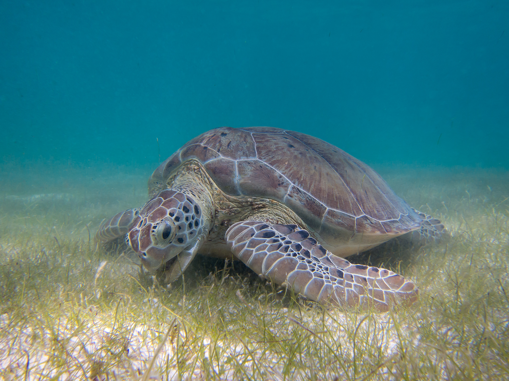

# video2animation
Tools for taking a video and converting the video to an animation using DeepArt and Ebsynth.

In a nutshell, Ebsynth can be used to take styles of still images and apply them onto entire videos. Typically a user will take a frame from a video, draw over it using the frame as the background of the scene, and Ebsynth will take over and attempt to apply the style to the rest of the video.

For those of us that can't draw well (myself included), we can use DeepArt to transfer styles from a style image to a target image.

As an example, using this as our style image:

and this as our target image:

DeepArt can give us this:

The idea here is to use DeepArt to apply styles to keyframes in a video, and then use Ebsynth to apply the style to the entire video.

## Requirements for DeepArt:
- tensorflow
- numpy
- scipy
- pillow
- opencv-python
- matplotlib

## Workflow:
1. Take a video and extract frames.
2. Take keyframes and convert using DeepArt.
3. Take video frames and keyframes and mass-style transfer using Ebsynth.
4. Create video at same frame rate as original.

Note that to save on processing time, the current maximum dimension of each frame is limited to 512 pixels.
